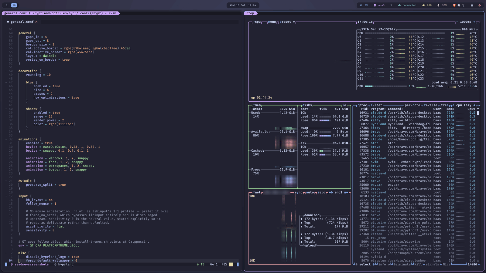
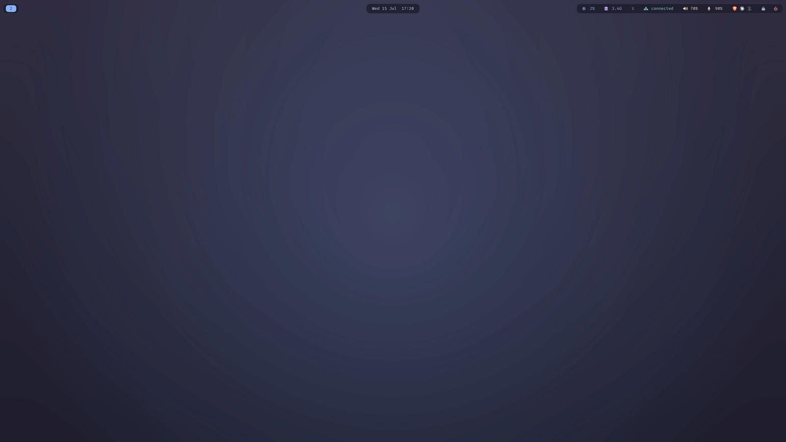
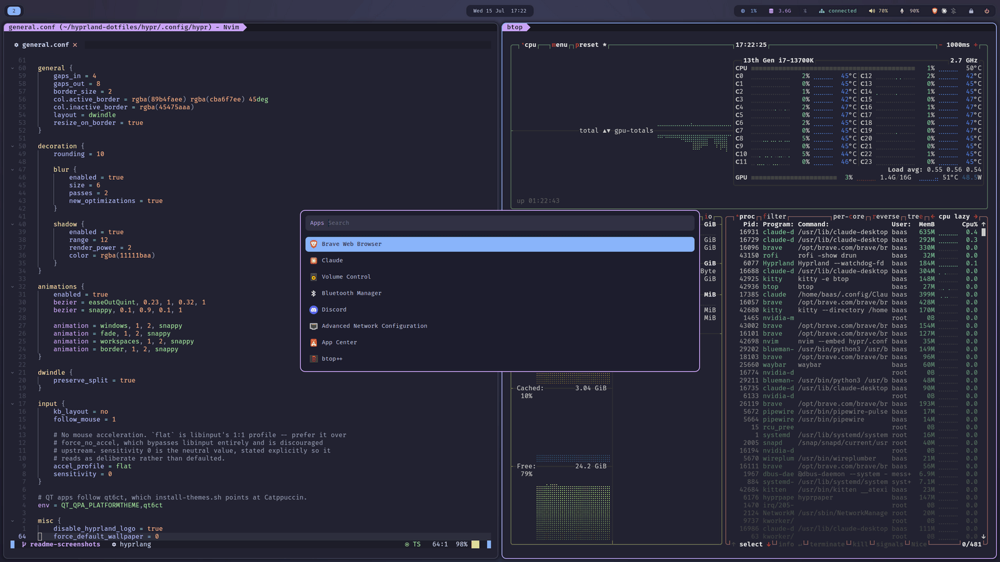
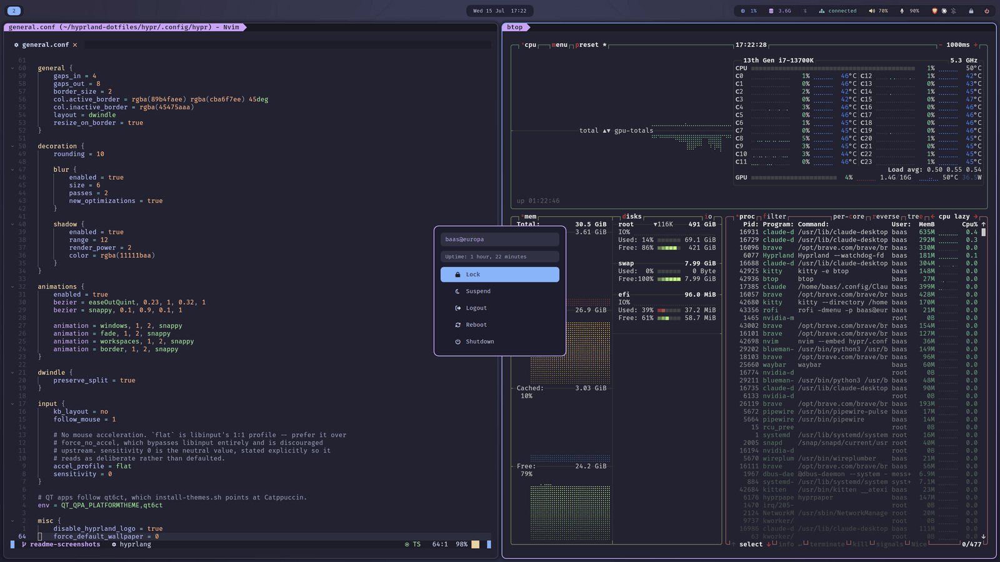
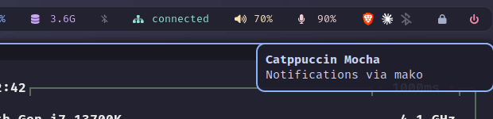

<h3 align="center">
	Hyprland — Catppuccin Mocha
</h3>

<p align="center">
	A complete, reproducible Hyprland rice for Arch Linux.<br/>
	One clone, one command.
</p>

<p align="center">
	
	
	
	
</p>

<p align="center">
	
</p>

## Previews

<details>
<summary>🖥️ &nbsp;Desktop</summary>

</details>

<details>
<summary>📊 &nbsp;Bar</summary>

</details>

<details>
<summary>🚀 &nbsp;Launcher</summary>

</details>

<details>
<summary>⏻ &nbsp;Power menu</summary>

</details>

<details>
<summary>🔔 &nbsp;Notifications</summary>

</details>

## Contents

| | |
|---|---|
| **Compositor** | Hyprland |
| **Bar** | Waybar |
| **Launcher / power menu** | Rofi |
| **Notifications** | mako |
| **Terminal** | kitty |
| **System monitor** | btop |
| **Editor** | Neovim (AstroNvim) |
| **Lock / idle** | hyprlock, hypridle |
| **Wallpaper** | hyprpaper |
| **File manager** | Nautilus |
| **Login** | greetd + nwg-hello |
| **Theme** | Catppuccin Mocha, everywhere |

## Install

> [!NOTE]
> **No Arch yet?** Install it first with **[docs/arch-install.md](docs/arch-install.md)**
> — it replaces Ubuntu without touching the Windows partition sharing the disk,
> and hands off to the steps below at the first TTY login.

Do it **staged**, not in one shot: install everything *except* the login screen
first, reboot to confirm the desktop actually comes up on your GPU, and only then
switch on the greeter — with a live check, because it's the one step that can
leave you without a graphical login. (Once you trust it, `./install.sh` with no
flags does all of it at once — but the first time on real hardware, stage it.)

**1. Clone into `~/hyprland-dotfiles`** (the path is hard-coded in a few configs,
so keep the target directory name):

```bash
git clone https://github.com/Benj181/conf-hyprland.git ~/hyprland-dotfiles
cd ~/hyprland-dotfiles
```

**2. Preview — writes nothing, runs every read-only check:**

```bash
./install.sh --dry-run
```

This is a real preflight, not just a stow rehearsal: the AUR and greeter steps do
all their checking with reads, so a dry run runs those checks too.

**3. Install everything except the login screen:**

```bash
./install.sh --skip-greeter
```

Packages, NVIDIA driver, Neovim, Nerd Fonts, theming, and every config symlinked
into place with GNU Stow — but no display-manager change yet.

**4. Reboot** — a new kernel or NVIDIA driver needs it:

```bash
reboot
```

**5. Confirm the desktop works, then enable the greeter.** You land at a TTY:

```bash
Hyprland                       # bring the desktop up by hand first
nwg-hello -t                   # preview the greeter in a window, greetd untouched
./scripts/install-greeter.sh   # install + enable greetd
sudo systemctl start greetd    # draws it live on vt1; `stop` to back out
```

Don't skip the live check — see [Login screen](#login-screen) for what to watch
for and how to roll back if it comes up black.

**6. Reboot** into the greeter.

Anything already in the way (a config from a previous setup) is moved to
`~/.dotfiles-backup-<timestamp>/`, never overwritten. Other flags:
`--skip-packages` (configs only, skips pacman/AUR/themes/nvim) and plain
`./install.sh` (all of the above in one run, greeter included).

> [!IMPORTANT]
> **Never `pacman -Sy <pkg>`.** It's a partial upgrade — refreshes the databases,
> then installs against libraries the rest of the system hasn't caught up to — and
> it breaks Arch systems. (`apt update && apt install` is fine; this isn't.)
> `packages.sh` uses one `pacman -Syu --needed` transaction instead. `paru -Sy`
> is the same trap.

> [!NOTE]
> This targets one machine (`europa`) — no hardware detection, no per-host
> profiles. Everything machine-specific lives in `hypr/.config/hypr/hardware.conf`.
> See [Hardware notes](#hardware-notes-europa).

## Structure

Each top-level directory is a stow package: its contents mirror `$HOME`, so
`hypr/.config/hypr/general.conf` is symlinked to `~/.config/hypr/general.conf`.

```
.
├── install.sh          # the only command you need
├── scripts/            # install steps, each idempotent and re-runnable
├── assets/             # README screenshots
├── hypr/               # compositor: entry point + modules
├── waybar/             # status bar
├── rofi/               # launcher, power menu (+ vendored Catppuccin palette)
├── mako/               # notifications
├── kitty/              # terminal (+ vendored Catppuccin theme)
├── btop/               # system monitor (+ vendored Catppuccin theme)
├── nvim/               # AstroNvim config
├── hyprlock/           # lock screen
├── hypridle/           # idle handling
├── theme/              # GTK3/GTK4/Qt colours
├── greeter/            # login screen -- copied to /etc, not stowed
└── wallpapers/         # referenced by absolute path, not stowed
```

`hypr/.config/hypr/hyprland.conf` is an entry point that only `source`s the
modules beside it. **`hardware.conf` holds everything specific to this
machine** — monitors and NVIDIA env. If a second machine ever appears, that's
the one file that needs to differ.

`hyprlock` and `hypridle` are separate packages that both install into
`~/.config/hypr/`, which the `hypr` package also owns. Stow handles this by
unfolding the directory into per-file symlinks. It's expected; just don't be
surprised that `~/.config/hypr` is a real directory rather than a single link.

## Keybinds

`$mod` is SUPER.

| Bind | Action |
|---|---|
| `$mod` + Return | kitty |
| `$mod` + R | rofi |
| `$mod` + E | nautilus |
| `$mod` + Q | close window |
| `$mod` + F | fullscreen |
| `$mod` + V | toggle floating |
| `$mod` + C | clipboard history |
| `$mod` + N / `$mod`+Shift+N | dismiss / restore notification |
| `$mod` + Shift + X | power menu |
| `$mod` + h/j/k/l | move focus |
| `$mod` + Shift + h/j/k/l | move window |
| `$mod` + 1-0 | workspace |
| `$mod` + Shift + 1-0 | move window to workspace |
| Print / `$mod` + Print | screenshot output / region |

## Theming

Everything is Catppuccin **Mocha**, vendored into the repo rather than pulled
from distro paths or third-party repos at install time. The gotchas that cost
real time:

- **Rofi** — palette in `rofi/.config/rofi/catppuccin-mocha.rasi`, layouts are
  ours. Don't point `@theme` at `/usr/share/rofi/themes/`; a distro path changes
  under you and falls back silently. Both layouts style **every** element state
  explicitly, because rofi's built-in default paints unstyled states cream on the
  dark theme.
- **btop** — `color_theme` takes the **bare theme name**, no path and no `.theme`
  suffix, or it silently falls back to a black background. The theme is vendored
  in `btop/.config/btop/themes/`.
- **GTK / Qt** — libadwaita apps (Nautilus) ignore `gtk-theme-name`, so they're
  recoloured via libadwaita's named colours in `theme/.config/gtk-4.0/gtk.css`.
  Nothing is downloaded (`catppuccin/gtk` was archived and wouldn't help anyway).
  Qt goes through qt6ct with a Fusion palette.
- **hyprpaper** — uses **≥ 0.8 block syntax** (`wallpaper { … }`); the old flat
  form is silently ignored. Paths must be absolute — `~`/`$HOME` aren't expanded.
- **Fonts** — configs ask for `FiraCode Nerd Font` (UI) and `FiraCode Nerd Font
  Mono` (terminal/editor); both must match `fc-list : family` **exactly** or the
  app falls back to tofu. `ttf-firacode-nerd` provides them; `ttf-fira-code` does
  **not** (no Nerd glyphs). `packages.sh` verifies both families after install.
- **Icons** — written as escapes, never literal glyphs: `\uXXXX` in the waybar
  JSON, `printf '\uXXXX'` in `powermenu.sh`. Pasted Private Use Area characters
  get silently stripped to nothing. Regenerate, don't paste — and render a
  codepoint to confirm it's the glyph you meant (`\u` takes 4 hex digits, `\U`
  takes 8).

## Login screen

**greetd + nwg-hello**, styled to match hyprlock (same wallpaper, palette, clock,
mauve input field). A minimal Arch install has no display manager, so this
installs one rather than replacing anything. `scripts/install-greeter.sh` copies
the config to `/etc` (the `greeter` user can't read `$HOME`) and verifies its
assumptions — CSS selectors, VT, backup array, fonts, default target — rather
than trusting them. Edit the files under `greeter/`, never the copies in `/etc`.

> [!WARNING]
> **This is the one step that can leave you without a graphical login.** The
> plumbing is VM-tested, but a VM has no GPU and NVIDIA is exactly what it can't
> check. That's why the [Install](#install) steps enable it with a live check
> (`nwg-hello -t`, then `systemctl start`/`stop greetd`) *before* you reboot —
> none of which commits anything. If greetd comes up black, `journalctl -u greetd
> -b` is the first place to look.

**Rollback is the bootloader, not another greeter** — there's no second display
manager here. At the GRUB menu press `e` and append `systemd.unit=multi-user.target`
to the kernel line; that boots to a TTY with greetd never started. Then:

```bash
sudo systemctl disable greetd
sudo systemctl set-default multi-user.target
```

Rehearse reaching that menu **before** you reboot — systemd-boot often hides it
(`timeout 0`, hold `Space` at POST). `Ctrl+Alt+F2` also works; VT switching is
kernel-level. `systemctl enable sshd` first is cheap insurance.

The finer details — why the form is on DP-3 only, the GTK CSS-name vs glade-id
trap, the generated (not vendored) template — live in the comments in
`scripts/install-greeter.sh` and `scripts/greeter-template.py`, next to the code
that depends on them.

## Neovim

Just a package (`neovim`, 0.12.4) plus a headless plugin sync — `install.sh` runs
both. `lua/plugins/{mason,treesitter,none-ls}.lua` are AstroNvim template stubs,
disabled by `if true then return {} end` on line 1; delete that line in an
interactive nvim (not the install script) to activate one.

## Hardware notes (europa)

RTX 5070 Ti (Blackwell), `nvidia-open`, two LG UltraGears at 2560x1440@180 with
DP-2 rotated portrait, Endgame Gear OP1 8k mouse. Machine-specific config lives in
`hypr/.config/hypr/hardware.conf`.

- **Blackwell is open-module only** — `nvidia-open`, no proprietary variant.
- **The driver is coupled to the kernel.** `nvidia-open` is prebuilt for the stock
  `linux` kernel; change the kernel and this changes too (`linux-lts` →
  `nvidia-open-lts`, else `nvidia-open-dkms` + headers). **Reboot after any
  `pacman -Syu` that lands a kernel** — the running kernel's modules go with it.
- **Early KMS is the prime suspect for a black greeter.** Nothing here configures
  loading NVIDIA modules from the initramfs. If greetd comes up black while
  `nwg-hello -t` works fine in a session, start there (`MODULES=(nvidia
  nvidia_modeset nvidia_uvm nvidia_drm)` in `/etc/mkinitcpio.conf`, then
  `mkinitcpio -P`).
- **`nvidia-drm.modeset=1` is not needed** — it's default-on for this driver.
- **VRR is off** on purpose (flicker-prone across multiple NVIDIA displays).
- **No battery, no backlight** — no such waybar modules or binds. External monitor
  brightness needs DDC/CI (`ddcutil`).
- **Mouse acceleration is off** via `accel_profile = flat` (libinput's 1:1
  profile, not `force_no_accel`).

## Uninstall

```bash
cd ~/hyprland-dotfiles
stow -D -t "$HOME" hypr waybar rofi mako kitty btop nvim hyprlock hypridle theme
```

That unlinks the configs but not the login screen (not a stow package). Unstowing
while greetd is still your only display manager leaves you logging into a session
whose config just vanished — so undo greetd separately, before you reboot:

```bash
sudo systemctl disable greetd
sudo systemctl set-default multi-user.target
```

<p align="center">
	
</p>

<p align="center">
	Palette by <a href="https://github.com/catppuccin/catppuccin">Catppuccin</a> ·
	Inspired by <a href="https://github.com/rizukirr/hyprsimple">hyprsimple</a>
</p>
