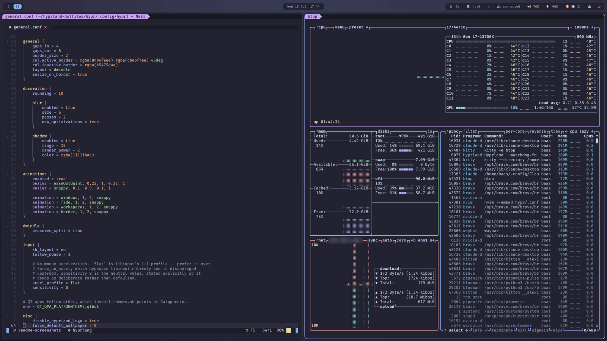
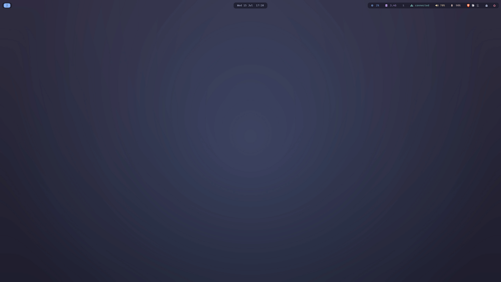
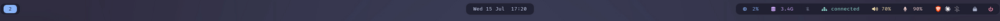
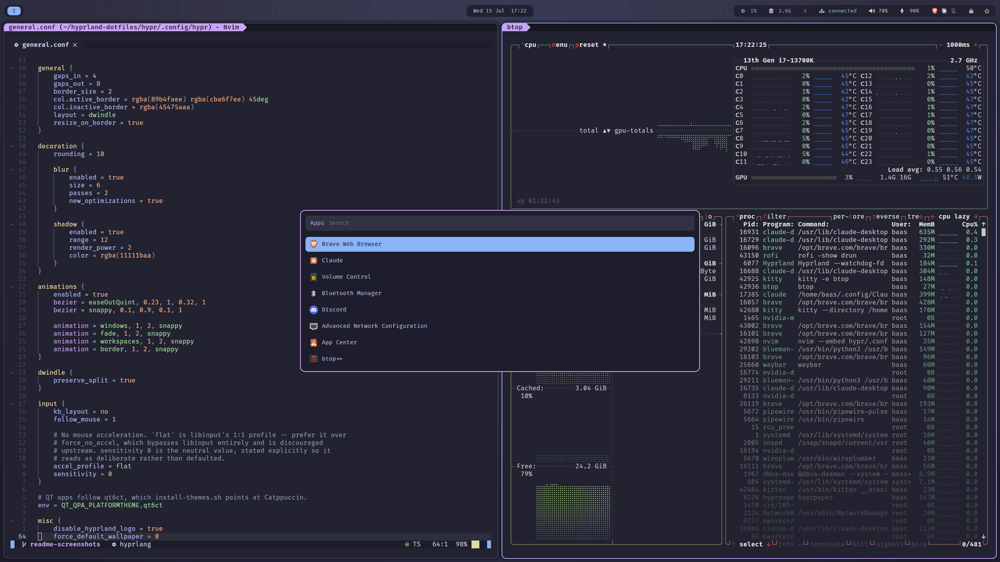
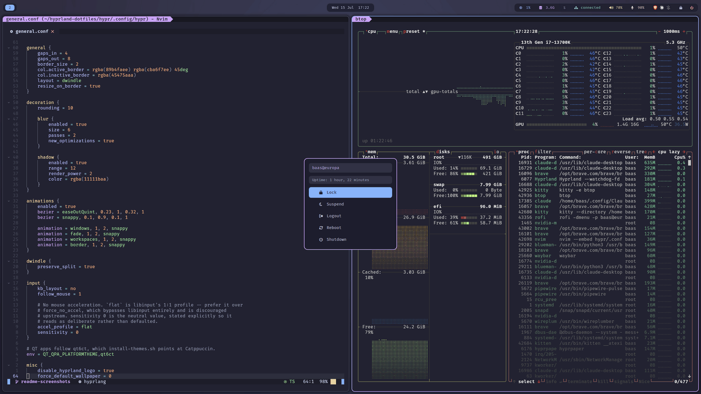
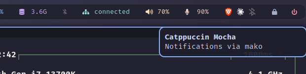

<h3 align="center">
	Hyprland — Monochrome
</h3>

<p align="center">
	A complete, reproducible Hyprland rice for Arch Linux.<br/>
	One clone, one command.
</p>

<p align="center">
	
	
	
	
</p>

<p align="center">
	
</p>

## Previews

<details>
<summary>🖥️ &nbsp;Desktop</summary>

</details>

<details>
<summary>📊 &nbsp;Bar</summary>

</details>

<details>
<summary>🚀 &nbsp;Launcher</summary>

</details>

<details>
<summary>⏻ &nbsp;Power menu</summary>

</details>

<details>
<summary>🔔 &nbsp;Notifications</summary>

</details>

## Contents

| | |
|---|---|
| **Compositor** | Hyprland |
| **Bar** | Waybar |
| **Launcher / power menu** | Rofi |
| **Notifications** | mako |
| **Terminal** | kitty |
| **Shell** | zsh — autosuggestions + syntax highlighting |
| **System monitor** | btop |
| **Editor** | Neovim (AstroNvim) |
| **Lock / idle** | hyprlock, hypridle |
| **Wallpaper** | hyprpaper |
| **File manager** | Nautilus |
| **Browser** | Brave |
| **Chat** | Discord |
| **Agentic coding** | Claude Code |
| **AUR helper** | paru (built from source) |
| **Rust** | rustup — stable, `complete` profile |
| **Login** | greetd + nwg-hello |
| **Secrets** | gnome-keyring, unlocked by PAM at login |
| **Theme** | Generated from one palette file — see [Theming](#theming) |

## Install

No Arch yet? Start with **[docs/arch-install.md](docs/arch-install.md)** — it
installs onto a dedicated drive alongside an existing Windows disk, and hands off
here at the first TTY login.

```bash
git clone https://github.com/Benj181/conf-hyprland.git ~/hyprland-dotfiles
cd ~/hyprland-dotfiles
./install.sh --dry-run        # writes nothing, runs every check
./install.sh                  # everything
```

Keep the directory name — a few configs hard-code the path. Anything already in
the way is moved to `~/.dotfiles-backup-<timestamp>/`, never overwritten.

| Flag | |
|---|---|
| `--dry-run` | report what would change, write nothing |
| `--skip-packages` | configs only — no pacman, AUR, themes or nvim |
| `--skip-greeter` | everything except the login screen |

> [!WARNING]
> The greeter is the one step that can leave you without a graphical login.
> First time on real hardware, stage it: `./install.sh --skip-greeter`, reboot,
> confirm the desktop comes up, then `./scripts/install-greeter.sh`. It prints a
> live check (`systemctl start greetd`) and a rollback before you commit.

## Theming

Every colour in the rice comes from one file. `palettes/<name>.env` is the
source; `scripts/theme.sh` renders it through `templates/` into the per-app
colour files each stow package ships, then reloads whatever is running.

```bash
./scripts/theme.sh --list          # what's available
./scripts/theme.sh mono-warm       # switch and apply, live
./scripts/theme.sh                 # re-render after editing a palette
```

| Palette | |
|---|---|
| `mono-neutral` | true neutral grey — no hue anywhere in the desktop chrome |
| `mono-warm` | slight brown cast, Gruvbox-material register |
| `mono-cool` | slight blue cast, closest to the old Catppuccin base |

Switching updates waybar, rofi, kitty, btop, mako, hyprlock, the wallpaper,
GTK3, GTK4/libadwaita, Qt (qt6ct), the Hyprland window borders and the greeter.
Hyprland, waybar, mako, kitty and hyprpaper reload in place; nvim, btop and
GTK/Qt apps pick it up on next launch. The greeter needs
`./scripts/install-greeter.sh` to copy the new stylesheet into `/etc`.

To try a scheme of your own, copy `palettes/mono-neutral.env` — it documents
what each key is used for, and `theme.sh` refuses to render a palette that is
missing one rather than shipping a config with a hole in it.

Two rules make this work, and breaking either produces a rice that drifts out
of sync one app at a time:

- **No hex values outside `palettes/` and `templates/`.** Anything hardcoded
  elsewhere will not follow a switch.
- **Generated files are build output.** They carry a `GENERATED` header and are
  committed so a fresh clone installs without running anything first. Edit the
  template, not the output. `./scripts/theme.sh --check` fails if the two have
  drifted apart, and `install.sh --dry-run` runs it.

### Design

Monochrome removes the obvious way to tell things apart, so the scheme leans on
brightness instead: `@dim` for ambient readouts, `@text` for what you look at
deliberately, `@accent` (white) for the one thing that is focused. Colour is
kept for the three cases where losing the signal costs something — critical
memory, a failed unlock, an urgent notification — plus the terminal and editor,
where achromatic ANSI would break `git diff` and every compiler's error output.

Geometry follows the same idea: `rounding = 2`, 1px borders, 2/4 gaps, and a
flat 30px bar with no per-section boxes, so the brightest and sharpest thing on
screen is always the window you are working in.

## Keybinds

`$mod` is SUPER.

| Bind | Action |
|---|---|
| `$mod` + Return | kitty |
| `$mod` + R | rofi |
| `$mod` + E | nautilus |
| `$mod` + B | brave |
| `$mod` + Q | close window |
| `$mod` + F | fullscreen |
| `$mod` + V | toggle floating |
| `$mod` + C | clipboard history |
| `$mod` + N / `$mod`+Shift+N | dismiss / restore notification |
| `$mod` + Shift + X | power menu |
| `$mod` + M | exit Hyprland |
| `$mod` + h/j/k/l | move focus |
| `$mod` + Shift + h/j/k/l | move window |
| `$mod` + 1-0 | workspace |
| `$mod` + Shift + 1-0 | move window to workspace |
| `$mod` + drag / right-drag | move / resize window |
| Volume up / down / mute | audio (`wpctl`) |
| Print / `$mod` + Print | screenshot output / region |

## Scripts

`install.sh` runs these in order. Each is idempotent and re-runnable on its own.

| Script | |
|---|---|
| `scripts/theme.sh` | renders the active palette into every app's colour file |
| `scripts/make-wallpaper.py` | palette-coloured wallpaper, called by `theme.sh` |
| `scripts/packages.sh` | pacman packages, NVIDIA driver, Rust toolchain |
| `scripts/install-aur.sh` | builds paru from source, then brave-bin + claude-code |
| `scripts/preflight.sh` | moves anything that would collide with stow |
| `scripts/install-themes.sh` | GTK/Qt dark mode and cursor, outside dotfiles |
| `scripts/install-keyring.sh` | PAM auto-unlock for gnome-keyring |
| `scripts/install-greeter.sh` | greetd + nwg-hello, copied to `/etc` |
| `scripts/greeter-template.py` | centres the greeter form, derived not vendored |
| `scripts/bootstrap-nvim.sh` | headless Neovim plugin sync |
| `scripts/install-zsh.sh` | sets zsh as the login shell (chsh) |

Every top-level directory is a stow package mirroring `$HOME` —
`hypr/.config/hypr/general.lua` → `~/.config/hypr/general.lua`. The exceptions
are `greeter/` and `wallpapers/` (copied to `/etc` and `/usr/share`, not
stowed) and `palettes/` and `templates/`, which are inputs to `theme.sh` and
never leave the repo.

## Notes

- **This targets one machine** (`europa`) — no hardware detection. Everything
  machine-specific is in `hypr/.config/hypr/hardware.conf`.
- **Never `pacman -Sy <pkg>`** — it's a partial upgrade and it breaks Arch. Same
  for `paru -Sy`. `paru -Syu` is the update path, including AUR.
- **Reboot after any `-Syu` that lands a kernel**, or the NVIDIA modules won't load.
- **Rust is `rustup`, not `rust`** — they conflict; `packages.sh` refuses up front
  and tells you what to remove.
- **The keyring needs two logins on a fresh install.** The first creates it, the
  second is when apps can see it. `./scripts/install-keyring.sh 0` tells you which
  state you're in.

The *why* behind all of the above lives in comments next to the code it applies
to — the install scripts and the config files themselves — rather than here,
where it would go stale out of sight.

## Uninstall

```bash
cd ~/hyprland-dotfiles
stow -D -t "$HOME" hypr waybar rofi mako kitty btop nvim hyprlock hypridle theme zsh
```

The greeter isn't a stow package, so undo it separately — **before** you reboot,
or you'll log into a session whose config just vanished:

```bash
sudo systemctl disable greetd
sudo systemctl set-default multi-user.target
```

Unstowing `zsh` removes `~/.zshrc` but not your login shell — switch back with
`chsh -s /usr/bin/bash` if you want that too.

<p align="center">
	Editor colours by <a href="https://github.com/zenbones-theme/zenbones.nvim">zenbones</a> ·
	Bar and window styling after <a href="https://github.com/ViegPhunt/Arch-Hyprland">ViegPhunt/Arch-Hyprland</a> ·
	Inspired by <a href="https://github.com/rizukirr/hyprsimple">hyprsimple</a>
</p>
